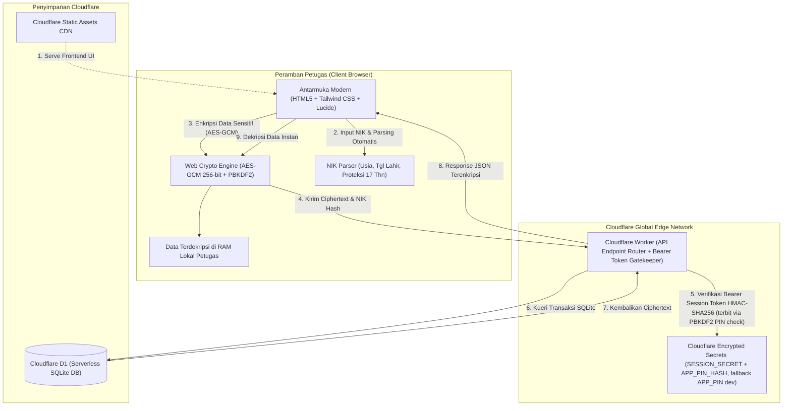

# 🪪 KATEPE — Sistem Database KTP & KIA Digital
### *"Buang tumpukan map berdebu! Ayo kelurahan & desa berbenah pakai teknologi!"*

[](https://github.com/dandsay/katepe)
[](https://workers.cloudflare.com/)
[]()
[](https://github.com/dandsay/katepe/blob/main/LICENSE)

---

## 📢 Suara Hati Staf Pelayanan: Woy, Stop Bikin Warga Nunggu Lama!

> *"Pernah gak sih warga datang ke loket nanya KTP-nya udah jadi atau belum, terus kita panik ngubek-ngubek tumpukan ratusan keping kartu fisik di laci berdebu sampai keringetan? Atau ada KTP perekaman baru yang usianya belum genap 17 tahun, eh malah gak sengaja diserahin ke warga karena gak ada sistem pengingat otomatis?"*

Jujur aja, **gue juga cuma staf biasa di kantor kelurahan**. Bukan orang dinas pusat, bukan programmer bergaji ratusan juta. Tapi gue punya rasa gregetan yang sama kayak rekan-rekan staf pelayanan di kantor desa, kelurahan, dan kecamatan se-Indonesia: **kenapa tata kelola arsip kependudukan fisik kita masih manual, ribet, dan rawan salah?**

Di kantor kelurahan, masalah klasik ini kejadian hampir tiap hari:
- **Tumpukan Kartu Mengendap:** Ratusan keping E-KTP dan KIA hasil cetak menumpuk di kantor, tapi kita gak tahu pasti mana yang sudah diambil warga dan mana yang masih mengendap berbulan-bulan.
- **Salah Serah KTP Belum 17 Tahun:** Ada pemohon perekaman KTP pemula yang belum genap 17 tahun saat kartu tercetak. Aturannya kartu wajib ditahan sampai hari ulang tahunnya, tapi sering kelepasan diserahkan karena ngecek manual tanggal lahir di NIK bikin mata sepet.
- **Data Warga Rawan Bocor:** Catat data NIK dan nama pemohon di kertas atau spreadsheet biasa yang rentan hilang, kehapus, atau diintip orang yang tidak berhak.
- **Pusing Bikin Laporan Bulanan:** Tiap akhir bulan harus ngitung manual jumlah KTP datang, terdistribusi, dan sisa blangko per RW buat laporan ke pimpinan/kecamatan.

**Maka dari itu, gue kembangin KATEPE!**  
Aplikasi manajemen database penerimaan dan penyerahan KTP-el & KIA modern yang **gratis (Zero-Cost)**, super aman berstandar enkripsi militer (**Zero-Knowledge**), dan dirancang khusus buat memudahkan hidup staf kelurahan di meja pelayanan maupun di lapangan.

Yuk bisa yuk, kelurahan dan desa di seluruh Indonesia kita bikin modern dan sat-set! 🚀

---

## ✨ Fitur-Fitur Jagoan KATEPE

### 1. 💰 Nol Rupiah Seumur Hidup (Zero Server Cost)
Gak perlu pusing bikin nota dinas pengajuan sewa hosting atau beli server mahal. Aplikasi ini berjalan 100% di **Cloudflare Workers & Cloudflare D1 (Serverless SQLite)** paket gratis (*Free Tier*). Kapasitasnya sanggup menampung puluhan ribu data kependudukan tanpa bayar sepeser pun!

### 2. 🔐 Kedaulatan Data Warga (Zero-Knowledge AES-GCM 256-bit)
Data kependudukan warga adalah amanah undang-undang:
- NIK, Nama Pemilik, dan Alamat warga **dienkripsi langsung di peramban (browser)** petugas menggunakan algoritma **AES-GCM 256-bit + PBKDF2** (`public/js/crypto.js`: kunci diturunkan dari PIN via PBKDF2-SHA256 50.000 iterasi, IV acak 12-byte per baris).
- Database Cloudflare D1 hanya menyimpan kode acak (*ciphertext*) + `nik_hash` (SHA-256) untuk pencarian. Dekripsi hanya terjadi di RAM browser petugas yang sudah login.
- Otorisasi API memakai **session token HMAC-SHA256 (Bearer, kedaluwarsa 12 jam)**. PIN diverifikasi server via **PBKDF2-SHA256 100.000 iterasi** (`APP_PIN_HASH`) dengan fallback `APP_PIN` hanya untuk dev lokal, plus delay anti-bruteforce dan perbandingan timing-safe.
- Enkripsi ini **membantu menerapkan prinsip** UU No. 27 Tahun 2022 tentang Perlindungan Data Pribadi (UU PDP), namun kepatuhan penuh tetap bergantung pada operasional (kerahasiaan PIN, perangkat petugas, manajemen secret).

### 3. 🧠 Otomatisasi Parsing NIK & Deteksi Usia 17 Tahun
Gak perlu lagi ngitung manual umur warga dari 16 digit NIK:
- Sistem otomatis membedah tanggal lahir, jenis kelamin, dan usia pemohon secara instan.
- **Proteksi Otomatis:** Jika mendeteksi usia belum genap 17 tahun, status kartu otomatis ditandai **`TAHAN (BELUM 17 TH)`** dengan badge merah mencolok agar tidak diserahkan sebelum hari ulang tahunnya tiba!

### 4. 📦 Pencocokan Cek Berkas Fisik vs Digital (SYNC / BELUM)
Ada badge status pencocokan di setiap baris:
- Petugas tinggal klik badge untuk mengubah status **SYNC** (fisik kartu sudah dicocokkan di laci) atau **BELUM** (belum diverifikasi fisiknya).
- Tersedia tombol satu kali klik **`Reset Cek Fisik`** untuk mereset seluruh status ketika kantor melakukan audit berkas berkala.

### 5. 🔍 Pencarian Berlapis Hemat Kuota D1
Mencari berkas warga gak pakai lama:
- **NIK 16 digit persis:** di-hash SHA-256 di browser lalu dicari via indeks `nik_hash` di server (O(1), 1 query).
- **Nama / alamat / RW / keterangan:** difilter instan di memori browser dari data tahun aktif yang sudah didekripsi (tanpa hit DB).
- **Deep search arsip on-demand:** jika tidak ketemu di tahun aktif, petugas klik tombol arsip untuk memuat `scope=all` dari D1. Pemuatan awal memakai model **1x load per tahun + berkas pending**, plus cache lokal agar hemat read D1.

### 6. 📄 Cetak Laporan Per RW & Rekap Bulanan Siap PDF
- **Cetak Lembar Serah Terima RW:** Mengikuti filter aktif dan otomatis **mengecualikan berkas berstatus ARSIP**, dikelompokkan per RW siap cetak untuk petugas lapangan, Ketua RT/RW, atau kader lingkungan.
- **Rekapitulasi Bulanan:** Backend (`/api/laporan-bulanan`) mengagregasi **datang vs terdistribusi per bulan**; frontend (`laporan-bulanan.js:calculateReport`) menghitung **sisa bulan lalu (akumulatif), jumlah, sisa akhir, dan persentase** per bulan.

### 8. 🛡️ Jaring Pengaman Administrasi & Status ARSIP
- **Validasi tanggal:** `tgl_ambil` tidak boleh lebih awal dari `tgl_datang` (divalidasi di create/update + UI arsip).
- **Tombol ARSIP mandiri:** menandai berkas sebagai `ARSIP` (status `SELESAI`, dikecualikan dari cetak RW) dan bisa dibatalkan kembali.
- **Endpoint batch dimatikan (410 Gone):** migrasi spreadsheet (era GAS) telah selesai; proses data kini 100% manual via web agar semua input melewati penjagaan yang sama.

### 7. 📱 Nyaman di Monitor Lebar & Ramah Layar HP
- Tampilan desktop widescreen (16:9) yang lega tanpa perlu geser scroll horizontal.
- Tampilan mobile responsif dengan kartu *expandable accordion* yang nyaman dibuka petugas lapangan via jempol smartphone (*thumb-friendly*).

---

## 📐 Arsitektur Sistem



---

## 📁 Struktur Direktori

```
katepe/
├── public/                       # Frontend Single Page Application (Static Assets)
│   ├── index.html                # Halaman Web Dashboard, Filter & Modal Dialog
│   ├── css/
│   │   └── style.css             # Stylesheet Cetak PDF Landscape & Animasi
│   ├── img/
│   │   └── logo-surabaya.svg     # Aset Visual & Logo Instansi
│   └── js/                       # Modul JavaScript Modular
│       ├── crypto.js             # Enkripsi & Dekripsi AES-GCM 256-bit + PBKDF2
│       ├── auth.js               # Manajemen Sesi PIN Login, Bearer Token & Kunci Kripto
│       ├── nik-parser.js         # Engine Pemecah NIK (Tanggal Lahir, Gender & Umur)
│       ├── ui-helpers.js         # Format Tanggal Lokal, Toast & Helper Clipboard
│       ├── filter.js             # Filter Interaktif RW, Tahun, & Status Pengambilan
│       ├── table-renderer.js     # Render Tabel Desktop & Kartu Accordion Mobile
│       ├── modals.js             # Modal Serahkan Kartu, Tambah, Edit & Hapus
│       ├── sync-status.js        # Pencocokan Berkas Fisik vs Digital (Toggle & Reset)
│       ├── print-rw.js           # Generator Format Cetak Lembar Serah Terima RW
│       └── laporan-bulanan.js    # Engine Agregasi Rekap Bulanan Siap Cetak
├── src/                          # Backend Cloudflare Worker (Serverless API)
│   ├── index.js                  # Router Utama, Bearer Gatekeeper & Asset Handler
│   ├── routes/
│   │   ├── auth.js               # Verifikasi PIN (PBKDF2 100k + timing-safe) & Terbit Token HMAC + Delay Anti-Bruteforce
│   │   ├── berkas.js             # Endpoint CRUD Terenkripsi + Validasi Tanggal + Batch Upsert ON CONFLICT
│   │   ├── stats.js              # Endpoint Agregat Metrik Database (single-pass + batch tahun)
│   │   └── laporan.js            # Endpoint Agregasi Bulanan (datang vs keluar per YYYY-MM)
│   └── utils/
│       ├── auth-crypto.js        # PBKDF2 Hash, HMAC Session Token & timingSafeEqual
│       └── response.js           # Response JSON Terstandar & Header Keamanan
├── scripts/
│   └── generate-pin-hash.js      # CLI Generate APP_PIN_HASH (node scripts/generate-pin-hash.js [pin])
├── schema.sql                    # Skema Tabel SQLite Cloudflare D1
├── .dev.vars.example             # Contoh Secret Lokal (SESSION_SECRET + APP_PIN_HASH + APP_PIN dev)
├── wrangler.jsonc                # Konfigurasi Cloudflare Workers & Binding D1
├── package.json                  # Konfigurasi Dependensi & Script CLI
└── .gitignore                    # Berkas Pengecualian Git (.dev.vars, types)
```

---

## 🚀 Panduan Pasang Mandiri

### 1. Persiapan Alat
- Pasang [Node.js](https://nodejs.org/) (versi 18 atau lebih baru).
- Punya akun [Cloudflare](https://dash.cloudflare.com/) (gratis, cukup daftar pakai email).

### 2. Kloning Repositori & Install
```bash
git clone https://github.com/dandsay/katepe.git
cd katepe
npm install
```

### 3. Buat Database Cloudflare D1
Jalankan perintah ini di terminal:
```bash
npx wrangler d1 create ktp-kia-db
```
Wrangler akan memberikan output seperti ini:
```jsonc
[[d1_databases]]
binding = "DB"
database_name = "ktp-kia-db"
database_id = "xxxxxxxx-xxxx-xxxx-xxxx-xxxxxxxxxxxx"
```
Salin nilai `database_id` yang muncul ke dalam file `wrangler.jsonc` pada baris `"database_id"`.

### 4. Tentukan PIN & Secret Keamanan Aplikasi
Generate hash PBKDF2 dari PIN pilihan Anda, lalu simpan ke brankas Cloudflare KMS:
```bash
node scripts/generate-pin-hash.js 123456
echo "pbkdf2$100000$..." | npx wrangler secret put APP_PIN_HASH
npx wrangler secret put SESSION_SECRET
```
*(`SESSION_SECRET` wajib string acak kuat min. 32 karakter untuk tanda tangan HMAC session token 12 jam. `APP_PIN` plaintext hanya fallback dev lokal — jangan dipakai di produksi.)*

Untuk uji coba di komputer sendiri, salin contoh lalu isi:
```bash
cp .dev.vars.example .dev.vars
```
```ini
SESSION_SECRET="kunci-rahasia-hmac-acak-minimal-32-karakter"
APP_PIN_HASH="pbkdf2$100000$..."
APP_PIN="123456"
```
*(Jangan pakai contoh `123456` di produksi — ganti dengan PIN kantor Anda.)*

### 5. Inisialisasi Tabel Database
- **Untuk di Komputer Lokal:**
  ```bash
  npm run d1:local
  ```
- **Untuk di Server Cloudflare (Produksi):**
  ```bash
  npm run d1:remote
  ```

### 6. Coba di Komputer Sendiri
```bash
npm run dev
```
Buka browser di `http://localhost:8787`, masukkan PIN Anda, dan aplikasi langsung siap dipakai!

### 7. Publikasikan ke Internet (Deploy)
```bash
npm run deploy
```
Dalam beberapa detik, aplikasi KATEPE kelurahan Anda sudah online secara global di jaringan edge Cloudflare Workers!

---

> ### 💡 BINGUNG CODING ATAU GAK NGERTI TERMINAL? SURUH AI AJA YANG GARAP!
> 
> *"Zaman sekarang udah era AI agent bro! Kalau kamu staf kelurahan yang gak paham kodingan atau takut buka-buka terminal hitam, gak usah pusing atau minder. Gampang banget:*
> 1. *Buka AI coding assistant andalan kamu (misalnya: Claude, ChatGPT, Cursor, Gemini, Copilot, atau Antigravity).*
> 2. *Copas link repositori GitHub ini (`https://github.com/dandsay/katepe`) atau upload file README ini ke AI tersebut.*
> 3. *Ketik instruksi simpel ini ke AI-nya:*  
>    > **"Halo AI, tolong pasangkan dan deploy proyek KATEPE ini ke akun Cloudflare saya sampai online dan siap saya pakai ya!"**
> 
> *Biar AI yang pusing ngurusin terminal, skrip database, dan deployment-nya. Kita staf kelurahan mah santai aja tinggal terima beres buat melayani warga!"* 😎🤖

---

## 🤝 Mari Majukan Pelayanan Publik Kita Bareng-Bareng!

Proyek ini didedikasikan untuk seluruh staf kelurahan, desa, dan kecamatan di Indonesia yang berjuang di garda terdepan pelayanan masyarakat.

- Punya saran alur baru?
- Butuh penyesuaian format cetak sesuai dinas daerah Anda?
- Menemukan kendala saat penggunaan?

Silakan buat **[Issue](https://github.com/dandsay/katepe/issues)** atau kirimkan **Pull Request**. Repositori ini adalah karya terbuka bersama untuk kemajuan bangsa.

**Maju terus Kelurahan & Desa Indonesia! Buang kertasmu, manfaatkan teknologi!** 🇮🇩
